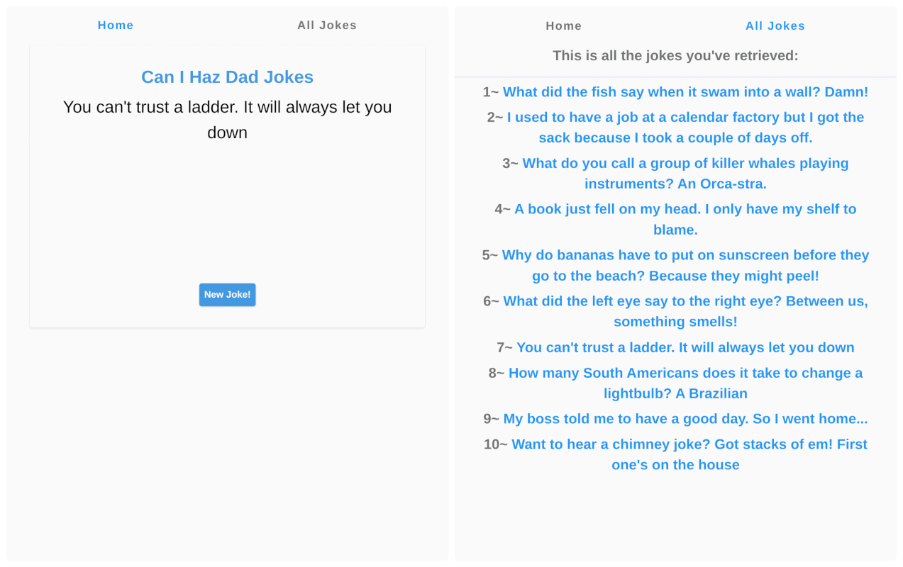

# Dad Jokes

> Simple app built with Vue and VueX using [icanhazdadjoke API](icanhazdadjoke.com) (The largest collection of dad jokes on the internet.)

<h2 align="center">
  
  <br>
</h2>


## Quick Start

```bash
# Install dependencies
cd dad-jokes
npm install

# Run
npm run serve
```